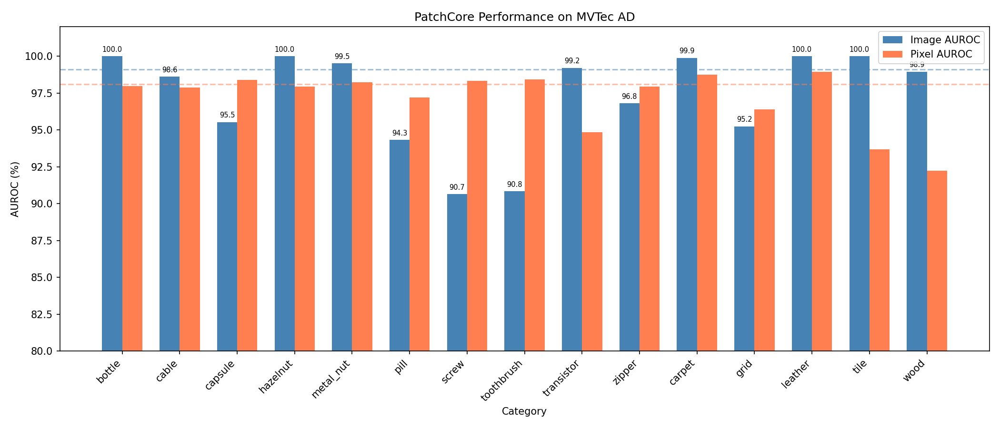
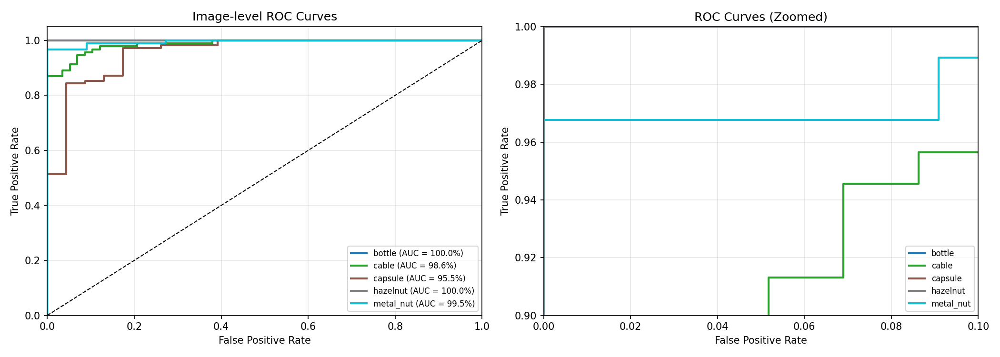

# PatchCore: Anomaly Detection with Pre-trained Features

PyTorch implementation of [PatchCore](https://arxiv.org/abs/2106.08265) for industrial anomaly detection on MVTec AD dataset.

## Overview

PatchCore is a **training-free** anomaly detection method that:
1. Extracts features from normal images using pre-trained backbone (WideResNet50)
2. Builds a memory bank with greedy coreset subsampling
3. Detects anomalies via k-NN distance to the memory bank

## Results

Performance on MVTec AD dataset (15 categories):

| Category | Image AUROC | Pixel AUROC |
|----------|-------------|-------------|
| bottle   | 100.0%      | 98.0%       |
| cable    | 98.6%       | 97.9%       |
| capsule  | 95.5%       | 98.4%       |
| carpet   | 99.9%       | 98.7%       |
| grid     | 95.2%       | 96.4%       |
| hazelnut | 100.0%      | 97.9%       |
| leather  | 100.0%      | 98.9%       |
| metal_nut| 99.5%       | 98.2%       |
| pill     | 94.3%       | 97.2%       |
| screw    | 90.7%       | 98.3%       |
| tile     | 100.0%      | 93.7%       |
| toothbrush| 90.8%      | 98.4%       |
| transistor| 99.2%      | 94.9%       |
| wood     | 98.9%       | 92.2%       |
| zipper   | 96.8%       | 98.0%       |
| **Average** | **97.3%** | **97.1%** |

*Tested with `coreset_ratio=0.01`, inference speed: ~3.5 FPS*

### Visualization Results

**Performance Comparison**


**ROC Curves**


**Anomaly Score Distributions**


All detailed metrics are available in `results/summary.json`

## Installation

```bash
pip install -r requirements.txt

# For GPU-accelerated k-NN (optional)
conda install -c conda-forge faiss-gpu
```

### Requirements
- Python 3.8+
- PyTorch >= 1.9.0
- CUDA 11.x (for GPU support)

## Dataset

Download [MVTec AD](https://www.mvtec.com/company/research/datasets/mvtec-ad) dataset:

```
MVTec AD/
├── bottle/
│   ├── train/
│   │   └── good/
│   └── test/
│       ├── good/
│       ├── broken_large/
│       └── ...
├── cable/
└── ...
```

## Usage

### Training

```bash
# Train single category
python train.py --data_path "/path/to/MVTec AD" --category bottle

# Train all categories
python train.py --data_path "/path/to/MVTec AD"

# Fast training (recommended for testing)
python train.py --coreset_ratio 0.01 --skip_existing
```

**Options:**
| Argument | Default | Description |
|----------|---------|-------------|
| `--data_path` | Required | Path to MVTec AD dataset |
| `--category` | `all` | Category to train |
| `--coreset_ratio` | `0.25` | Coreset subsampling ratio (0.01~0.25) |
| `--batch_size` | `32` | Batch size for feature extraction |
| `--skip_existing` | `False` | Skip already trained categories |

### Evaluation

```bash
# Evaluate single category
python evaluate.py --category bottle

# Evaluate all categories
python evaluate.py
```

## Project Structure

```
.
├── config.py           # Configuration dataclasses
├── dataset.py          # MVTec AD dataset loader
├── patchcore.py        # PatchCore model implementation
├── train.py            # Training script
├── evaluate.py         # Evaluation script
├── visualization.ipynb # Anomaly map visualization
├── checkpoints/        # Saved memory banks
└── results/            # Evaluation results & anomaly maps
```

## How It Works

```
Training:
  Normal Images → WideResNet50 → Feature Extraction → Coreset Subsampling → Memory Bank

Inference:
  Test Image → WideResNet50 → Feature Extraction → k-NN Search → Anomaly Score
```

**Key insight**: No gradient updates or fine-tuning. Just feature extraction and nearest neighbor search.

## References

- Paper: [Towards Total Recall in Industrial Anomaly Detection](https://arxiv.org/abs/2106.08265)
- Dataset: [MVTec AD](https://www.mvtec.com/company/research/datasets/mvtec-ad)

## License

MIT
